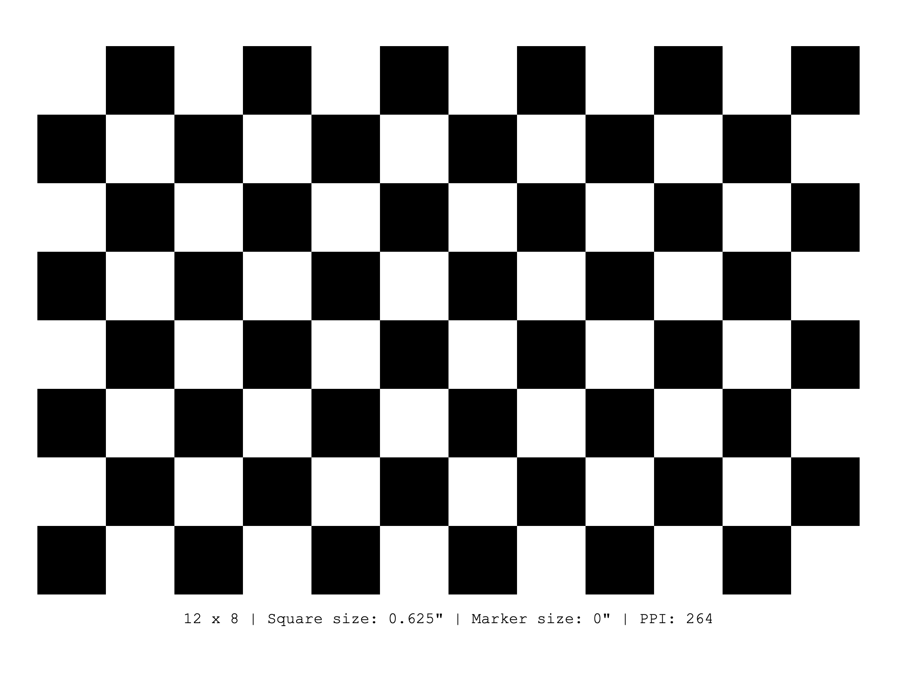

# Cowlibration: Digital Board
A digital calibration board used for calibrating camera intrinsics.

## Usage
Host a web server locally with `python -m http.server [PORT]` or access via [Github Pages](https://theholycows.github.io/cowlibration-board/application/).

Note that by default, it is configured for a iPad Pro 11" (2018 - 2020), which has a pixel density of 264 PPI.

### Adjusting PPI
Modify the `PPI` constant at the top of [`application/script.js`](application/script.js).
